# StoreHelper Guide

Implementing and testing in-App purchases with `StoreKit2` and `StoreHelper` in **Xcode 14/13** with **SwiftUI**, **Swift 5.7**, **iOS 16/15** and **macOS 13/12**.

---

# Description


This document describes how to implement and test in-app purchases with **SwiftUI**, `StoreHelper`, `StoreKit2`, **Xcode 14/13**, **iOS 16/15** and **macOS 13/12**.

- See [StoreHelper Quick Start](https://github.com/russell-archer/StoreHelper/blob/main/Documentation/quickstart.md) for a short tutorial on using `StoreHelper` to add in-app purchase support to your **iOS 16/macOS 13 SwiftUI** app
- See [StoreHelperDemo](https://github.com/russell-archer/StoreHelperDemo) for an example SwiftUI project using StoreHelper with **Xcode 14** and **iOS 16**
- See [In-App Purchases with Xcode 12 and iOS 14](https://github.com/russell-archer/IAPDemo) for details of working with `StoreKit1` in **iOS 14**

---

# Recent Changes
- 27 November, 2022
	- Major update to the way **subscriptions** are handled
	- Subscription prices now show **prices and renewal periods**
	- **Promotional and Introductory offers** on subscriptions are now supported
	- The most appropriate **promotional** or **introductory** offers or standard price and renewal period are automatically displayed
	- Additions to `StoreHelper.SubscriptionHelper`: `hasLowerValueCurrentSubscription(than:)`, `isLapsedSubscriber(to:)`, `allSubscriptionTransactions()`
	- Added in-app redemption of **offer codes**
	- Added new sections to the **Guide** on "Subscription Introductory and Promotional Offers" and "Supporting In-App Offer Code Redemption"
	- **Quick Start** and **Guide** documentation reviewed and updated for iOS16/macOS13/Xcode14 and new subscription features
- 7 Nov, 2022
    - Minor changes re upgrade to iOS 16 and macOS 13
- 19 October, 2022
	- Added new section to the Guide on "Restoring Previous Purchases"
- 15 March, 2022
	- Changed the initialization flow because of a new warning in Xcode 13.3 related to having `@MainActor init()`
	- Removed the need for StoreHelper's init method to run on the main thread by moving some initialization code to a new `start()` method
	- You should now call `StoreHelper.start()` as soon as possible after initializing `StoreHelper`
	- The `start()` method starts listening for transactions and get localized product info from the App Store
	- Updated all documentation because of this change
- 25 January, 2022
	- Refactored `StoreHelper` as a SPM Package
	- Moved example app to separate repo ([StoreHelperDemo](https://github.com/russell-archer/StoreHelperDemo))
	- Updated documentation re change to SPM package
- 19 January, 2022
	- Major updates to documentation
	- Added Mac target
- 21 December, 2021
	- Updated documentation to reflect refactoring changes
- 20 December, 2021
	- Refactored throughout so that this non-private version of `StoreHelper` is in-sync with private `StoreHelper` code used in an app released to the App Store
- Xcode 13 Beta 5
	- Modified `StoreHelper.checkVerificationResult(result:)` to return `UnwrappedVerificationResult`. This includes a new `VerificationResult<T>.VerificationError` that is provided by StoreKit2 when the unwrapped transaction is unverified
- Xcode 13 Beta 4
	- None required
- Xcode 13 Beta 3
	- The use of `Task.Handle` has been deprecated
	- The `StoreHelper` transaction listener now has a type of `Task<Void, Error>`
	- The return type for `StoreHelper.handleTransactions()` changed from `Task.Handle<Void, Error>` to `Task<Void, Error>`
	- The `detach` keyword for creating detached tasks has been deprecated
	- The use of `detach` in `StoreHelper.handleTransactions()`  has been replaced with `Task.detached`
	- The use of `async {}` blocks in a synchronous context has been deprecated
	- All `async {}` blocks have been replaced with `Task.init {}`
- Xcode 13 Beta 2
	- `Transaction.listener` is now `Transaction.updates`
	- `Product.request(with:)` is now `Product.products(for:)`

---

# Source Code
The latest version of `StoreHelper` is always available [on GitHub](https://github.com/russell-archer/StoreHelper). 

> **Disclaimer**. The source code presented here is for educational purposes. 
> You may freely reuse and amend this code for use in your own apps. However, you do so entirely at your own risk.

---

# Contents

- [Description](#Description)
- [Recent Changes](#Recent-Changes)
- [Source Code](#Source-Code)
- [Contents](#Contents)
- [References](#References)
- [Overview](#Overview)
- [What's changed from the original StoreKit?](#What's-changed-from-the-original-StoreKit)
	- [Receipt validation](#Receipt-validation)
	- [Async Await support](#Async-Await-support)
	- [Should I use StoreKit1 or StoreKit2?](#Should-I-use-StoreKit1-or-StoreKit2)
- [StoreHelperDemo App](#StoreHelperDemo-App)
- [Get Started](#Get-Started)
- [Defining our Products](#Defining-our-Products)
- [Create the StoreKit configuration file](#Create-the-StoreKit-configuration-file)
- [Enable StoreKit Testing via the Project Scheme](#Enable-StoreKit-Testing-via-the-Project-Scheme)
- [Creating a Production Product List](#Creating-a-Production-Product-List)
- [Logging](#Logging)
- [Getting a list of Products from the App Store](#Getting-a-list-of-Products-from-the-App-Store)
- [Displaying Products](#Displaying-Products)
- [The Product type](#The-Product-type)
- [Purchasing Products](#Purchasing-Products)
- [Purchase support in StoreHelper](#Purchase-support-in-StoreHelper)
- [Making a Purchase and Validating the Transaction](#Making-a-Purchase-and-Validating-the-Transaction)
- [Ask-to-buy support](#Ask-to-buy-support)
- [What Products has the user purchased](#What-Products-has-the-user-purchased)
- [Restoring Previous Purchases](#Restoring-Previous-Purchases)
- [Network connectivity issues](#etwork-connectivity-issues)- [Consumables](#Consumables)
- [The Receipt](#The-Receipt)
- [Consumables](#Consumables)
- [Displaying Non-Consumable Purchase Information](#Displaying-Non-Consumable-Purchase-Information)
- [Subscriptions](#Subscriptions)
	- [Displaying Subscription information](#Displaying-Subscription-information)
	- [Upgrading a Subscription](#Upgrading-a-Subscription)
	- [Introductory and Promotional Subscription Offers](#Introductory-and-Promotional-Subscription-Offers)
		- [Signing Promotional Offers](#Signing-Promotional-Offers)
		- [Defining offers in App Store Connect](#Defining-offers-in-App-Store-Connect)
		- [Subscription Offer Keys](#Subscription-Offer-Keys)
		- [Defining offers in the StoreKit Testing environment](#Defining-offers-in-the-StoreKit-Testing-environment)
	- [How StoreHelper displays Standard, Promotional or Introductory Offer Prices](#How-StoreHelper-displays-Standard-Promotional-or-Introductory-Offer-Prices)
	- [Supporting In-App Offer Code Redemption](#Supporting-In-App-Offer-Code-Redemption)
- [Managing Subscriptions](#Managing-Subscriptions)   
- [Refunds](#Refunds)
- [Direct purchases of App Store Promotions](#Direct-purchases-of-App-Store-Promotions)
---

# References
- https://developer.apple.com/in-app-purchase/
- https://developer.apple.com/documentation/storekit/in-app_purchase
- https://developer.apple.com/documentation/storekit/choosing_a_storekit_api_for_in-app_purchase
- https://developer.apple.com/documentation/storekit/in-app_purchase/implementing_a_store_in_your_app_using_the_storekit_api
- https://developer.apple.com/design/human-interface-guidelines/in-app-purchase/overview/introduction/
- https://developer.apple.com/videos/play/wwdc2021/10175 
- https://developer.apple.com/videos/play/wwdc2021/10114/
- https://developer.apple.com/support/universal-purchase/

---
# Overview
This document discusses how to use Apple's `StoreKit2` framework to provide in-app purchases in your **iOS** or **macOS** **SwiftUI**-based apps. 

Specifically, we'll cover:

- How to use the `StoreHelper` SPM package to create a multi-platform (iOS and macOS) SwiftUI app that allows users to purchase a range of products, including:
	- **Consumables** (VIP plant installation service: lasts for one day)
	- **Non-consumables** (cut flowers, potted plants, chocolates, etc.)
	- **Subscriptions** (VIP plant home care: scheduled home visits to water and care for house plants)
- An in-depth review of how to use `StoreHelper`, a Swift package that encapsulates `StoreKit2` in-app purchase functionality and makes it easy to work with the App Store
- Developing a demo app (**StoreHelperFlorist**) for an on-line florist that sells a range of flowers, chocolates and other related services like home visits to water and care for house plants
- Requesting localized **product information** from the App Store
- How to **purchase** a product and **validate the transaction**
- Handling **pending ("ask to buy") transactions** where parental permission must be obtained before a purchase is completed
- Handling **cancelled** and **failed transactions**
- Handling customer **refunds**
- Managing **subscriptions**
- Exploring detailed **transaction information and history** for non-consumables and subscriptions
- Testing purchases locally using **StoreKit configuration** files
- Support for direct App Store purchases of **promoted in-app purchases**

# What's changed from the original StoreKit?
There are two **huge** changes from the previous (original) version of StoreKit (`StoreKit1` hereafter):

## Receipt validation
With `StoreKit1` validating the receipt issued by the App Store was a tricky process that required:

- Working with the C-based `OpenSSL` library to decrypt, read and validate receipt data (on-device validation), or
- Setting up an app server to communicate with the App Store server (server-based validation)

See [In-App Purchases with Xcode 12 and iOS 14](https://github.com/russell-archer/IAPDemo) for more details.

`StoreKit2` now uses the industry-standard JSON Web Signature (`JWS`) format as a secure container for transaction information signed by the App Store:

- JWS is easy to read - no need for a third-party cryptography library!
- Better still, transactions are now **automatically** validated by `StoreKit2`!!

## Async/Await support
`StoreKit1` uses a delegate-based method of working with async APIs and notifications:

- This leads to code that is difficult to read, with program flow being somewhat disjointed

`StoreKit2` fully embraces the new `Async`/`Await` pattern introduced in Swift 5.5, Xcode 13 and iOS 15:

- This makes working with async APIs much easier and results in a more natural flow to your code

## Should I use StoreKit1 or StoreKit2?
Working with in-app purchases using `StoreKit2` is a ***vastly*** superior experience over using `StoreKit1` and you should choose to use it if possible.
However, `StoreKit2` requires that your app targets **iOS 15/macOS 12**. If you need to support iOS 14 and lower you'll need to continue using `StoreKit1`.

Apple provides [documentation](https://developer.apple.com/documentation/storekit/choosing_a_storekit_api_for_in-app_purchase) to help you decide which version of StoreKit is right for your app.

The good news is that although there are two versions of the StoreKit, both frameworks share a common App Store backend:

- Both versions of StoreKit provide access to the same in-app purchase product data you configure in the App Store
- Both versions of StoreKit provide the exact same UI experience for users
- Transactions made with one version of StoreKit are immediately available in the other version

# StoreHelperDemo App


The best way to get familiar with `StoreKit2` is to create a simple, but full-featured (from an in-app purchase perspective) demo app. You may be surprised how little "app code" is required to implement in-app purchases: `StoreHelper` and `StoreKit2` handle all the heavy-lifting!

# Get Started
To get started, create a new multi-platform Xcode project and add the `StoreHelper` package. See [StoreHelper Quick Start](https://github.com/russell-archer/StoreHelper/blob/main/Documentation/quickstart.md) for details.
Make sure that both the iOS and macOS targets include the `StoreHelper` library, and that both targets support the **In-App Purchase** capability. Adding this capability also adds the `StoreKit2` framework to your project:


# Defining our Products
Before we do anything else we need to define the products we'll be selling. Ultimately, this will be done in **App Store Connect**. However, testing in-app purchases (IAPs) using an **App Store Sandbox** environment takes quite a bit of setting up and is rather frustrating to work with. 

> The sandbox test environment requires you to create multiple **sandbox test accounts** in App Store Connect. Each sandbox account has to have a unique email address and be validated as an AppleID. In addition, sandbox tests must be on a real device, not the simulator.
> 
> Prior to iOS 15, you need to **sign out** of your normal AppleID and sign-in using the sandbox account. This really means you need a spare device to do testing on.
>  
> When sandbox testing on a real device with iOS 15 onwards, you **no longer need to sign-out of your AppleID before making sandbox purchases**.
> This means that if you don't have a dedicated test device you can safely carry out sandbox testing on your main device! All you need to do is run the app and start a purchase. At this point you will be prompted to login to the App Store: use your **sandbox account credentials**.
> 
> Prior to WWDC21, using the sandbox test environment was pretty painful. Each time you made a purchase using a sandbox account that account became “used up” and couldn't be used to re-purchase the same product. There was no way to clear purchases and you had to use a fresh sandbox account for each set of product purchases. Happily, post-WWDC21 you can now reset a user's purchases (on App Store Connect), change the account region and adjust renewal rates!

Fortunately, there's now a much better way.

Introduced in Xcode 12, a new **local** StoreKit test environment allows you to do early testing of IAPs in the simulator without having to set anything up in App Store Connect. You define your products locally in a **StoreKit Configuration** file. Furthermore, you can view and delete transactions, issue refunds, and a whole lot more. There’s also a new `StoreKitTest` framework that enables you to do automated testing of IAPs. We'll use this approach to test IAPs in our app.

# The StoreKit configuration file
You create a **StoreKit Configuration File** by selecting **File > New > File** and choosing the **StoreKit Configuration File** template:

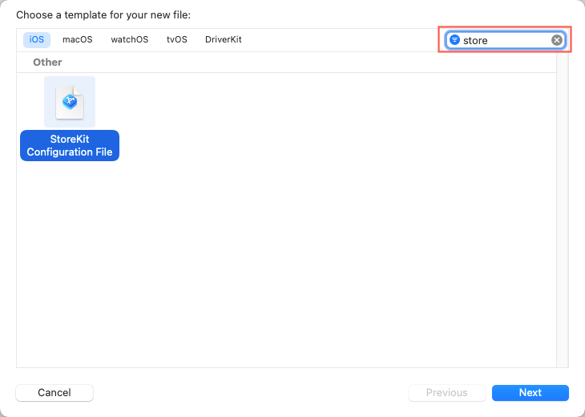

Starting with Xcode 14, you can choose to create a **synced** `.storekit` configuration file that is linked to in-app purchases already defined in App Store Connect. Once you've created the synced `.storekit` configuration file you can't edit it locally in Xcode, all changes have to be made in App Store Connect.

After clicking **Next** you'll be asked if you want to create a synced `.storekit` configuration file:

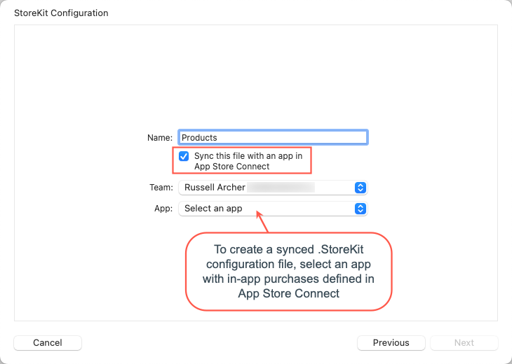

For the purposes of this documentation it's assumed that you'll create a local (non-synced) `.storekit` configuration file.

`StoreHelper` includes a sample `Products.storekit` file in the `StoreHelper/Samples/Configuration` folder which you should copy to the `Shared/Configuration` folder of your project:


When you want to modify the list of products, open the `Products.storekit` configuration file and click **+** to add an in-app purchase. For example, select the **Add Non-Consumable In-App Purchase** option:


You can now define your products in the StoreKit configuration file. Here's an example of a non-consumable product:

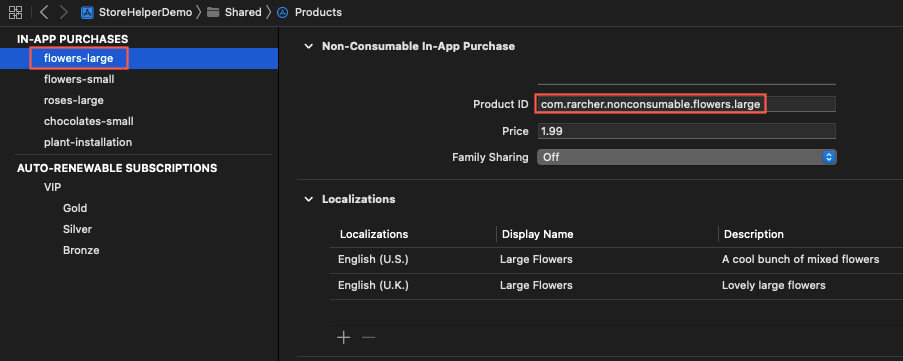

The fields available are as follows:

- **Type**
The type of product (Non-Consumable, Consumable, Non-Renewing, Auto-Renewing).

- **Reference Name** 
A short descriptive reference for the product. Not visible to users.

- **Product ID** 
The unique code used to identify an IAP product. This same ID will be used in App Store Connect when setting up in-app purchases for production. 
Note that Product ID is a string that, by convention, uses the format *com.developer.productType.productName*, although it can be anything you like. 
Not visible to users.

- **Price** 
A hard-coded price for the product. In production your app will request localized price (and other) information from the App Store. Visible to users.

- **Family Shareable**
True if purchases can be shared by family members, false otherwise. Visible to users.

- **Locale**
By default, the first localization is for the US store. This is used if no other localizations are defined. You can add as many localizations as required. Visible to users.

- **Description**
A short description of the product. Visible to users.

- **Display Name**
The name for the product that users see.

> Note that none of the data defined in the local (non-synced) `.storekit` file is ever uploaded to App Store Connect. It’s only used when testing in-app purchases locally in Xcode.

# Enable StoreKit Testing via the Project Scheme
You need to enable StoreKit testing in Xcode, as it’s disabled by default.

Select **Product > Scheme > Edit Scheme**. 
Now select **Run** and the **Options** tab. 
You can now select your configuration file from the **StoreKit Configuration** list:


Should you wish to disable StoreKit testing then repeat the above steps and remove the StoreKit configuration file from the **StoreKit Configuration** list.

# Creating a Production Product List
We'll see shortly how one of the first things our app has to do on starting is request localized product information from the App Store. This is the case both when 
using the local StoreKit test environment and the live App Store environment. This requires a list of our **product identifiers** (`ProductId`). 

We've defined our products in the StoreKit configuration file, so it seems obvious that we should use that as the repository for our IAP data. Retrieving config data at runtime isn't difficult 
(it's `JSON`). However, the `.storekit` configuration file is intended for use *when testing* and it's not a good idea to use it for production too. It would be all too easy to allow "test products" to make it into the release build!

Your project should include a list of product identifiers in a property list named `Products.plist`. Save it in the `Shared/Configuration` folder and make sure to include it in the **Target Membership** for both targets:

```xml
<?xml version="1.0" encoding="UTF-8"?>
<!DOCTYPE plist PUBLIC "-//Apple//DTD PLIST 1.0//EN" "http://www.apple.com/DTDs/PropertyList-1.0.dtd">
<plist version="1.0">
<dict>
    <key>Products</key>
    <array>
        <string>com.rarcher.nonconsumable.flowers.large</string>
        <string>com.rarcher.nonconsumable.flowers.small</string>
        <string>com.rarcher.nonconsumable.roses.large</string>
        <string>com.rarcher.nonconsumable.chocolates.small</string>
        <string>com.rarcher.consumable.plant.installation</string>
        <string>com.rarcher.subscription.vip.gold</string>
        <string>com.rarcher.subscription.vip.silver</string>
        <string>com.rarcher.subscription.vip.bronze</string>
    </array>
</dict>
</plist>
```

To help it read the property list `StoreHelper` includes a `PropertyFile` struct with a single `static read(filename:)` method. See `PropertyFile.swift`  in the `Sources/StoreHelper/Util` folder:

```swift
struct PropertyFile {
    
    /// Read a plist property file and return a dictionary of values
    static func read(filename: String) -> [String : AnyObject]? {
        if let path = Bundle.main.path(forResource: filename, ofType: "plist") {
            if let contents = NSDictionary(contentsOfFile: path) as? [String : AnyObject] {
                return contents
            }
        }
        
        return nil  // [:]
    }
}
```

# Logging
While researching and testing `StoreKit2` I found it really helpful to see informational messages about what's going. Rather than use `print()` statements I created a simple logging `StoreLog` struct that would work for both debug and release builds.

I use Apple's unified logging system to log errors, notifications and general messages. This system works on simulators and real devices for both debug and release builds. You can view the logs in the Console app by selecting the test device in the left console pane.

If running on the simulator, select the machine the simulator is running on. Type your app's bundle identifier into the search field and then narrow the results by selecting "SUBSYSTEM" from the search field's filter. Logs also appear in Xcode's console in the same manner as print statements.

When running the app on a real device that's not attached to the Xcode debugger, dynamic strings (i.e. the error, event or message parameter you send to the event() function) will not be publicly viewable. They're automatically redacted with the word "private" in the console. This prevents the accidental logging of potentially sensitive user data. Because we know in advance that `StoreNotificaton` enums do not contain sensitive information, we let the unified logging system know it's OK to log these strings through the use of the "%{public}s" keyword. However, we don't know what the event(message:) function will be used to display, so its logs will be redacted.

# Getting a list of Products from the App Store
The first thing our app needs to do is get a list of our products that our app has for sale from the App Store. If you've not worked with in-app purchases before this it might seem a bit strange. Surely, our app would store a list of product details and then display them for the user. However, the key concept here is that we want ***localized*** information about our products. For example, we define the general *price band* that we want each product to be in, and the App Store gives our app an up-to-date price in the **user's local language and currency**. That way our app is freed from having to know anything about the user's location, local currencies, etc. So, we generically define our products and the App Store provides our app with locally-specific product data.

This procedure is the same whether you're using a local StoreKit test environment, sandbox testing or the live App Store:

- Get a `Set` of `ProductId` (e.g. hardcode the list, or read it from a property file as `StoreHelper` is setup to do)
- Asynchronously call the `StoreKit2` `Product.products(for:)` method, passing it the set of `ProductId`
- The App Store returns a collection of `Product`, each element of which contains localized product information
- Display product information, along with a purchase button, to the user

These are the steps required to request localized product information from the App Store when using `StoreHelper`:

- `StoreHelper` is a class that conforms to the `ObservableObject` protocol:

```swift
@available(iOS 15.0, macOS 12.0, *)
/// StoreHelper encapsulates StoreKit2 in-app purchase functionality and makes it easy to work with the App Store.
public class StoreHelper: ObservableObject { ... }
```

- An instance of `StoreHelper` is stored in a `@StateObject` property in your demo project's app object `StoreHelperDemoApp`, and added to the SwiftUI view environment :

```swift
@main
struct StoreHelperDemoApp: App {
    
    // Create the StoreHelper object that will be shared throughout the View hierarchy
    @StateObject var storeHelper = StoreHelper()
    
    var body: some Scene {
        WindowGroup {
            MainView()
            .environmentObject(storeHelper)  // Add storeHelper to the environment
            .task { storeHelper.start() }  // Start listening for transactions and get localized product info
        }
    }
}
```

- When an instance of `StoreHelper` is initialized its `init()` method reads the list of `ProductId` from the `Products.plist` file and saves it in the `productIds` property. We use an Apple package named `swift-collections` (https://www.swift.org/blog/swift-collections/) to provide an `OrderedSet` type (https://github.com/apple/swift-collections/blob/main/Documentation/OrderedSet.md) for the set of product ids:

```swift
/// `OrderedSet` of `ProductId` that have been read from the Product.plist configuration file. The order in which
/// product ids are defined in the property list file is maintained in the set.
public private(set) var productIds: OrderedSet<ProductId>?
```

-  `StoreHelper` then requests localized product information from the App Store:

```swift
/// Request localized product info from the App Store for a set of ProductId.
///
/// This method runs on the main thread because it may result in updates to the UI.
/// - Parameter productIds: The product ids that you want localized information for.
/// - Returns: Returns an array of `Product`, or nil if no product information is returned by the App Store.
@MainActor public func requestProductsFromAppStore(productIds: OrderedSet<ProductId>) async -> [Product]? {
	guard let localizedProducts = try? await Product.products(for: productIds) else {
		isAppStoreAvailable = false
		return nil
	}
	
	isAppStoreAvailable = true
	return localizedProducts
}
```

- The collection of `Product` containing localized product info is stored in the `products` array. Note that `products` is a `@Published` property. This means we can use it to trigger updates to our UI:

```swift
/// Array of `Product` retrieved from the App Store and available for purchase.
@Published private(set) var products: [Product]?
```

The following diagram shows the flow for requesting localized product information from the App Store using `StoreHelper`:


# Displaying Products
The `StoreHelper` package includes some images for example products (see `Samples/Images`). They're named with the same unique product ids defined in the `Products.storekit` and `Products.plist` files. See [StoreHelper Quick Start](https://github.com/russell-archer/StoreHelper/blob/main/Documentation/quickstart.md) for details. Add these sample images to your demo app's **Asset Catalog**:

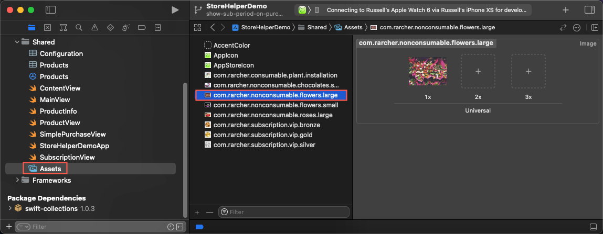

The hierarchy of views used to display products is broken into a number of small, specialized views that each deal with relatively simple tasks. Here's how non-consumable products are displayed:


Running the app's iOS target produces:


Note that prices are in US dollars. This is because, by default in test environment, the App Store `Storefront` is **United States (USD)** and the localization is **English (US)**. To support testing other locales you can change this. Make sure the `Products.storekit` file is open, then select **Editor > Default Storefront** and change this to another value. You can also changed the localization from **English (US**) with **Editor > Default Localization**.

Here I selected **United Kingdom (GBP)** as the storefront and **English (UK)** as the localization. I also created some UK-specific descriptions of the products. Notice how prices are now in UK Pounds:


# The Product type
The `Product` struct is a an important object in `StoreKit2`. We've seen how the `static` `Product.products(for:)` method is used to request product information from the App Store. It's also used for several other key operations:


# Purchasing Products
To purchase a product we need to call the `purchase()` method on the `StoreKit2` `Product` object that represents the product we want to purchase. The `PriceView` view displays the product's price on a button that makes the purchase via a `PriceViewModel`. Here's a simplified version of `PriceView` that shows how easy it is to make a purchase:

```swift
//
//  PriceView.swift
//  StoreHelper
//
//  Created by Russell Archer on 21/06/2021.
//

import SwiftUI
import StoreKit

/// Displays a product price and a button that enables purchasing.
struct PriceView: View {
    @EnvironmentObject var storeHelper: StoreHelper
    @State private var canMakePayments: Bool = false
    @Binding var purchaseState: PurchaseState  // Propagates the result of a purchase back from `PriceViewModel`
    
    var productId: ProductId
    var price: String
    var product: Product
    
    var body: some View {
        
        let priceViewModel = PriceViewModel(storeHelper: storeHelper, purchaseState: $purchaseState)
        
        HStack {
            Button(action: {
                withAnimation { purchaseState = .inProgress }
                Task.init { 
	                await priceViewModel.purchase(product: product)   // <-- Make a purchase
	            }
            }) {
                PriceButtonText(price: price, disabled: !canMakePayments)
            }
            .disabled(!canMakePayments)
        }
        .task { canMakePayments = AppStore.canMakePayments }
    }
}

struct PriceButtonText: View {
    var price: String
    var disabled: Bool
    var frameWidth: CGFloat = 95
    
    var body: some View {
        Text(disabled ? "Disabled" : price)
            .font(.body)
            .foregroundColor(.white)
            .padding()
            .frame(width: frameWidth, height: 40)
            .fixedSize()
            .background(Color.blue)
            .cornerRadius(25)
            .padding(.leading, 10)
    }
}
```

Notice how we need to add a `Task.init {...}` block to our button's action closure. This allows us to run async code in a "synchronous context" (a `View`).

The `purchaseState: PurchaseState` binding property is the mechanism that propagates the result of a purchase from the `PriceViewModel.purchase(product:)` method, up through the  `PriceView` -> `PurchaseButton` -> `ProductView` view hierarchy. 

`PurchaseState` is defined in `StoreHelper.swift` and has the following possible values:

```swift
public enum PurchaseState { case notStarted, userCannotMakePayments, inProgress, purchased, pending, cancelled, failed, failedVerification, unknown }
```

A simplified version of the `PriceViewModel` view model that handles the purchase looks like this:

```swift
import StoreKit
import SwiftUI

/// ViewModel for `PriceView`. Enables purchasing.
struct PriceViewModel {
    
    @ObservedObject var storeHelper: StoreHelper
    @Binding var purchaseState: PurchaseState
    
    /// Purchase a product using StoreHelper and StoreKit2.
    /// - Parameter product: The `Product` to purchase
    @MainActor func purchase(product: Product) async {

        do {
            
            let purchaseResult = try await storeHelper.purchase(product)
            withAnimation { purchaseState = purchaseResult.purchaseState } 
            
        } catch { purchaseState = .failed }  // The purchase or validation failed
    }
}
```

# Purchase support in StoreHelper
We now need to see how purchasing is handled by `StoreHelper`. The main things to note are:

- A `@Published` array of `ProductId` that holds the ids of purchased products:

```swift
/// Array of `ProductId` for products that have been purchased. Each purchased non-consumable product will appear
/// exactly once. Consumable products can appear more than once.
///
/// This array is primarily used to trigger updates in the UI. It is not persisted but re-built as required
/// whenever a purchase successfully completes, or when a call is made to `isPurchased(product:)`.
///
/// - Call `isPurchased(product:)` to see if any type of product has been purchased and validated against the receipt.
/// - Call `StoreHelper.count(for:)` to see how many times a consumable product has been purchased.
@Published private(set) var purchasedProducts = [ProductId]()
```

- A `purchaseState` property that holds the current state of purchasing:

```swift
/// The current internal state of StoreHelper. If `purchaseState == inProgress` then an attempt to start
/// a new purchase will result in a `purchaseInProgressException` being thrown by `purchase(_:)`.
private var purchaseState: PurchaseState = .unknown
```

- A `purchase(_:)` method:

```swift
/// Purchase a `Product` previously returned from the App Store following a call to `requestProductsFromAppStore()`.
///
/// May throw an exception of type:
/// - `StoreException.purchaseException` if the App Store itself throws an exception
/// - `StoreException.purchaseInProgressException` if a purchase is already in progress
/// - `StoreException.transactionVerificationFailed` if the purchase transaction failed verification
///
/// - Parameter product: The `Product` to purchase.
/// - Returns: Returns a tuple consisting of a transaction object that represents the purchase and a `PurchaseState`
/// describing the state of the purchase.
@MainActor public func purchase(_ product: Product) async throws -> (transaction: Transaction?, purchaseState: PurchaseState)  { ... }
```

- A **task handle** and associated `handleTransactions()` method that enables us to listen for App Store transactions. These transactions are things like resolution of "ask-to-buy" (pending) purchases, refunds, restoring purchases, etc.:

```swift
/// Handle for App Store transactions.
private var transactionListener: Task<Void, Error>? = nil

init() { transactionListener = handleTransactions() }

deinit { transactionListener?.cancel() }

@MainActor private func handleTransactions() -> Task<Void, Error> { ... }
```

# Making a Purchase and Validating the Transaction
Using `StoreHelper` to make a purchase is pretty simple:

1. The user taps the `PriceView` button, which calls `PriceViewModel.purchase(product:)`, passing the `Product` to purchase:
2. `PriceViewModel` calls `purchase(_:)` in `StoreHelper`, passing the `Product` to purchase
3. `StoreHelper` asynchronously calls `StoreKit.purchase(_:)` and awaits the result(error handling, logging and non-essential code removed for brevity):

```swift
@MainActor public func purchase(_ product: Product) async throws -> (transaction: Transaction?, purchaseState: PurchaseState)  {	
	// Start a purchase transaction
	purchaseState = .inProgress

	guard let result = try? await product.purchase() else {
		purchaseState = .failed
		throw StoreException.purchaseException
	}

	// We now have a PurchaseResult value. See if the purchase suceeded, failed, was cancelled or is pending.
	switch result {
		case .success(let verificationResult):
			
			// Did the transaction pass StoreKit’s automatic validation?
			let checkResult = checkVerificationResult(result: verificationResult)
			if !checkResult.verified {
				purchaseState = .failedVerification
				throw StoreException.transactionVerificationFailed
			}
			
			// The transaction was successfully validated.
			let validatedTransaction = checkResult.transaction
			
			// Update the list of purchased ids. Because it's is a @Published var this will cause the UI
			// showing the list of products to update
			await updatePurchasedIdentifiers(validatedTransaction)
			
			// Tell the App Store we delivered the purchased content to the user
			await validatedTransaction.finish()
			
			// Let the caller know the purchase succeeded and that the user should be given access to the product
			purchaseState = .purchased	
			return (transaction: validatedTransaction, purchaseState: .purchased)
			
		case .userCancelled:
			purchaseState = .cancelled
			return (transaction: nil, .cancelled)
			
		case .pending:
			purchaseState = .pending
			return (transaction: nil, .pending)
			
		default:
			purchaseState = .unknown
			return (transaction: nil, .unknown)
	}
}
```

4. `StoreKit2` leads the user through the purchase process and provides all the UI required
5. `StoreKit2` talks to the App Store to complete the purchase
6. The App Store completes the purchase and sends `StoreKit2` a purchase `Product.PurchaseResult` object
7. `StoreHelper` uses the `PurchaseResult` to check if the purchase was a success and that the transaction was **verified**
8. `StoreHelper` returns the transaction and a `PurchaseState` to the `PriceViewModel`, which assigns the `PurchaseState` value to the `purchaseState` binding property (which makes the result of the purchase available up the view hierarchy)

A key point to note is how we **validate** or **verify** transactions. Every time our app receives a transaction (e.g. when a purchase is made) from the App Store via `StoreKit2`, the transaction has **already passed through a verification process** to confirm whether the transaction is signed by the App Store for **this app** on **this device**. 

> `Storekit2` does **automatic** transaction ("receipt") verification ("validation") for you. So, no more using OpenSSL to decrypt and read App Store receipts or sending receipts to an Apple server for verification! 
> 
> Note that the App Store cryptographically secures and signs each transaction using the industry-standard JSON Web Signature (`JWS`) format. The `Transaction` object provides access to the underling JWS as a `String` property, so you may perform your own validation if required (although this probably won't be necessary for most apps).
        
In our `StoreHelper.purchase(_:)` method, we call the `StoreKit2` `product.purchase()` method and get a `PurchaseResult` back that indicates `success`, `userCancelled`, or `pending`. The call to `product.purchase()` may also throw an exception, which indicates that the purchase failed.

If the purchase seems to have succeeded (`PurchaseResult == .success`), `StoreKit2` has already automatically attempted to validate the transaction, returning the result of this validation wrapped in a `VerificationResult`.

We check the `VerificationResult<Transaction>` to see if the transaction passed or failed the verification process. This is equivalent to receipt validation in `StoreKit1`. 

If the verification process is a success we update our collection of purchased product ids and give the user access to the purchased product.

The simplified purchase process flow (showing mainly the "success" path) is as follows:


1. The user taps the `PriceView` button, which calls `PriceViewModel.purchase(product:)`, passing the `Product` to purchase
2. `PriceViewModel` calls `purchase(_:)` in `StoreHelper`, passing the `Product` to purchase
3. If there's already a purchase in progress, then a `StoreException.purchaseInProgressException` is thrown and caught by `PriceViewModel`
4. `StoreHelper` asynchronously calls `StoreKit.purchase(_:)` and awaits the result
5. `StoreKit2` leads the user through the purchase process and provides all the UI required
6. `StoreKit2` talks to the App Store to complete the purchase
7. The App Store completes the purchase and sends `StoreKit2` a purchase `Transaction` object
8. `StoreKit2` verifies that the purchase `Transaction` is correctly signed by the App Store and that the purchase is valid for the current user on the particular device in use. A `Product.PurchaseResult` is returned to `StoreHelper`:
	- If `StoreKit2` encounters an error then a `StoreKitError` exception is thrown
	- If App Store encounters an error then a `PurchaseError`  exception is thrown
	- Any exceptions are caught by `StoreHelper`, which re-throws a `StoreException.purchaseException`. This will be caught by `PriceViewModel`
9. `StoreHelper` checks the `Product.PurchaseResult` returned by `StoreKit2`, if it's a success it...
10. ...checks the `VerificationResult` (which is wrapped up in the `PurchaseResult`). If this results in a valid `Transaction` then...
11. ... the collection of purchase product ids is updated to add the newly purchased product
12. `StoreHelper` tells `StoreKit2` the `Transaction` is finished and returns the `Transaction` object to `PriceViewModel`. It sets a binding property to show the purchase was a success and the UI is re-rendered

# Ask-to-buy support
The App Store supports the concept of "ask-to-buy" purchases, where parents can configure an Apple ID to require their permission to make a purchases. 
When a user makes this type of purchase the `PurchaseResult` returned by StoreKit's `product.purchase()` method will have a value of `.pending`. This
state can also be applicable when a user is required to make banking changes before a purchase is confirmed.

With `StoreKit` testing (which works with both `StoreKit1` and `StoreKit2`) we can easily simulate pending purchases to see if our app correctly supports them.

To enable ask-to-buy support in `StoreKit` select the `.storekit` configuration file and then select **Editor > Enable Ask To Buy**:


Now run the demo app and attempt to make a purchase. You'll find that the purchase proceeds as normal. 
However, instead of receiving a purchase confirmation you'll see an **Ask Permission** alert:


Tap **Ask** and you'll see that the purchase enters a `.pending` state, as denoted by the orange hourglass next to the product purchase button:


With the app still running, click the **Manage StoreKit Transaction** button on the Xcode debug area pane:


You'll now be able to see the transaction that is "Pending Approval". Right-click the transaction that is pending approval and select **Approve Transaction**:


You should see the purchase confirmed as `StoreHelper` processes the transaction:


The console shows how `StoreHelper` handled the process:


# What Products has the user purchased?
What happens if we quit and restart the demo app? How do we know what purchases the user has previously made?

If you stop and re-run the app you'll see that without any work on our part it seems to remember what's been purchased. This is because the UI calls `StoreHelper.isPurchased(product:)` for each product when it's displayed. This checks `Transaction.currentEntitlement(for:)` to get a list of transactions for the user. This supports both non-consumable in-app purchases and active subscriptions.

But there is a potential (and non-obvious) problem here. `StoreKit2` has to check a user's transactions and entitlements. To do this it seems to require a connection to the App Store **and** availability of the App Store-issued receipt (see below). But what happens when the network is unavailable and the App Store can't be reached? Does it simply rely on the receipt (which is what I expected)?

In my testing of production apps that use `StoreHelper` I found that under certain circumstances (see below), if there's no network connection `StoreKit2` will fail to recognize previously purchased products. I was puzzled by this, because there should always be a **receipt** issued by the App Store, stored *on the device* in the app's **main bundle**. The receipt contains a complete record of a user's in-app purchase history for that app.  

When an app is installed (or re-installed) the App Store issues a receipt at the same time which *includes any previous transactions*. That is, purchases made by the user previously on the same device, or purchases made on another device belonging to the same user (i.e. using the same Apple ID). This is a change from how things worked previously with `StoreKit1` where, in order to sync with the App Store and receive an up-to-date receipt, the user would have to "restore" previous purchases (see **Restoring Previous Purchases**). With `StoreKit2`, users don't need to restore previous transactions when your app is installed/reinstalled. 

# Restoring Previous Purchases
Apples's documentation states that apps **must** provide a mechanism to allow users to manually restore previous in-app purchases. 

> **Important**
> Failure to provide a "Restore" button will result in apps being rejected during the App Store review process. 
> By default, StoreHelper provides the required Restore button on the `Products` view. 

With Xcode 14 and iOS16/macOS13 Apple states that manually (and programmatically) restoring previous purchases should no longer normally be necessary. However, you MUST still provide a manual restore feature or your app will be rejected during the review process.

Programmatically restoring purchases simply requires an `async` call to `AppStore.sync()`. However, it's not a good idea to initiate a restore unless the user *specifically* requests it. This is because the user will immediately be prompted to authenticate with the App Store. This behaviour can be very disconcerting for the user, as it may not be obvious *why* they're being asked for their credentials.

# Network connectivity issues
I have found that if you have:

- made purchases, and
- the app has **not** been closed (quit), then
- you lose connectivity
- `StoreKit2` will use the receipt to successfully check for previous purchases

However:

- if you have made purchases, and
- the app **has** been closed (quit) , then
- you lose connectivity
- re-open the app
- `StoreKit2` will NOT use the receipt to check for purchases and all checks for purchases **fail**

Given the potential for unhappy customers, `StoreHelper` includes "fallback" collection of purchases (product ids) that gets persisted and is automatically and transparently used as a backup when the App Store's not available.

# The Receipt
The main differences between `StoreKit1` and `StoreKit2` receipts are:

- `StoreKit1` 
	- The receipt is a **signed** and **encrypted file**
	- Stored in the app's main bundle
	- The location of the receipt is given by `Bundle.main.appStoreReceiptURL`
	- See https://github.com/russell-archer/IAPHelper for details on reading and validating the receipt with `StoreKit1`

- `StoreKit2`
	- The receipt is a **SQLite database** (`receipts.db`)
	- Contains all of the user's transactions

So, just out of interest, where is the receipt and can we look at its contents?!

Unless you jailbreak your iPhone you can't view the receipts database on a real device. However, when using the simulator you **can** directly view the contents of the database. The easiest way to find the path to the database is to add the following print statement somewhere in your app:

```swift
print("StoreKit1 receipt is here: \(Bundle.main.appStoreReceiptURL!)")
```

This gives you URL of the `StoreKit1` receipt. It will be something like:

```bash
/Users/{your-name}/Library/Developer/CoreSimulator/Devices/{device-id}/data/Containers/Data/Application/{app-id}/StoreKit/receipt
```

The `receipt` directory will contain the old-style `StoreKit1` encrypted receipt. 

If you navigate to `...{app-id}/Library/Caches/StoreKit` you should see the `StoreKit2` receipts database:


If you have a SQLite client installed (I used **SQLPro for SQLite**) you can open the database. Here's what it looks like having made two purchases:


We can immediately see how each transaction is structured, with the `product_id` column showing the `ProductId` of the purchase. 
The `receipt` column is a plain text field where the contents are clearly encrypted:


So, because we know an up-to-date version of the receipts database will always be present, we can use it (via `StoreKit2`) to find out a user's product entitlements.

# Consumables
Now we have the basics of the app working, we can move onto looking at another type of product: **consumables**.

Consumables are products that are used once, or for a limited time and then expire. If the user wants to use the product again they need to re-purchase. A typical consumable product would be a token in game that temporarily gives you more lives or higher powers. Once the token's used up the user would lose the abilities it confers.

The demo app contains a consumable called "VIP plant installation service". It lasts for one appointment and then expires. We define the product like this:


It's also included in our **Products.plist**:

```xml
<?xml version="1.0" encoding="UTF-8"?>
<!DOCTYPE plist PUBLIC "-//Apple//DTD PLIST 1.0//EN" "http://www.apple.com/DTDs/PropertyList-1.0.dtd">
<plist version="1.0">
<dict>
    <key>Products</key>
    <array>
        <string>com.rarcher.nonconsumable.flowers-large</string>
        <string>com.rarcher.nonconsumable.flowers-small</string>
        <string>com.rarcher.nonconsumable.roses-large</string>
        <string>com.rarcher.nonconsumable.chocolates-small</string>
        <string>com.rarcher.consumable.plant-installation</string>
        <string>com.rarcher.subscription.vip.gold</string>
        <string>com.rarcher.subscription.vip.silver</string>
        <string>com.rarcher.subscription.vip.bronze</string>
    </array>
</dict>
</plist>
```

However, purchasing consumables (and checking to see if a consumable has been previously purchased) has to be handled rather differently than for non-consumables. This is because:

> Transactions for consumable products ARE NOT STORED IN THE RECEIPT!

The rationale for this from Apple's perspective is that consumables are "ephemeral". 
To quote Apple's documentation (https://developer.apple.com/documentation/storekit/transaction/3851204-currententitlements) for `Transaction.currentEntitlement(for:)`:

> The current entitlements sequence emits the latest transaction for each product the user is currently entitled to, specifically: 
> - A transaction for each consumable in-app purchase that you have not finished by calling `finish()`

In tests I've done transactions for consumables do not remain in the receipt, even if you omit to call `finish()`.

So, if you plan to sell consumable products in your own apps you'll need to create some sort of system for keeping track of them. This could be as simple as storing data in `UserDefaults`. However, for greater security use either the keychain or a database as part of your backend solution.

Currently, `StoreHelper` uses a **Keychain**-based system that simply keeps a count of each purchase of a consumable product. Each time the consumable is purchased the count is incremented. When a purchase is "expired" the count is decremented. When the count reaches zero the user no longer has access to the product.

There's a helper class for that:

```swift
import Foundation
import Security

/// A consumable product id and associated count value.
public struct ConsumableProductId: Hashable {
    let productId: ProductId
    let count: Int
}

/// KeychainHelper provides methods for working with collections of `ConsumableProductId` 
/// in the keychain.
public struct KeychainHelper {
    public static func purchase(_ productId: ProductId) -> Bool { ... }
    public static func expire(_ productId: ProductId) -> Bool { ... }
    public static func has(_ productId: ProductId) -> Bool { ... }
    public static func count(for productId: ProductId) -> Int { ... }
    public static func update(_ productId: ProductId, purchase: Bool) -> Bool { ... }
    public static func delete(_ consumableProduct: ConsumableProductId) -> Bool  { ... }
}
```

`StoreHelper` also includes a `ConsumableView` that displays a count of the number of unexpired purchases of the consumable product the user has. 

Every time you purchase a consumable, the demo app simply shows a purchase-count badge like this:


# Displaying Non-Consumable Purchase Information
At the bottom of each purchased product we show some purchase summary information. The user can tap on the purchase info to display a sheet with more detailed information:


Getting purchase information for non-consumables is very straightforward. The `latestTransaction` property of a `Product` gives you a `VerificationResult<Transaction>` for the most recent transaction on the product:

```swift
// If nil the product has never been purchased
guard let unverifiedTransaction = await product.latestTransaction else { ... }
```

`VerificationResult<Transaction>` is the result of StoreKit's attempt to verify the transaction. You can unwrap it and gain access to the `Transaction` object with a call to `StoreHelper.checkVerificationResult(result:)`:

```swift
let transactionResult = checkVerificationResult(result: unverifiedTransaction)
guard transactionResult.verified else { ... }
```

If `StoreKit2` verified the transaction then we can access the date when the purchase was made:

```swift
if product.type == .nonConsumable {    
    let datePurchased = transactionResult.transaction.purchaseDate
}
```

The `StoreHelper.purchaseInfo(for:)` method is used to gather the required purchase information:

```swift
/// Transaction information for a non-consumable product.
/// - Parameter product: The `Product` you want information on.
/// - Returns: Transaction information on a non-consumable product.
/// If the product is not non-consumable nil is returned.
@MainActor public func purchaseInfo(for product: Product) async -> PurchaseInfo? {
	
	guard product.type == .nonConsumable else { return nil }
	
	var purchaseInfo = PurchaseInfo(product: product)
	guard let unverifiedTransaction = await product.latestTransaction else { return nil }
	
	let transactionResult = checkVerificationResult(result: unverifiedTransaction)
	guard transactionResult.verified else { return nil }
	
	purchaseInfo.latestVerifiedTransaction = transactionResult.transaction
	return purchaseInfo
}
```

The struct returned by `StoreHelper.purchaseInfo(for:)` is used to neatly package purchase information in a ready-to-use format:

```swift
public struct PurchaseInfo {
    /// The product.
    var product: Product

    /// The most recent unwrapped StoreKit-verified transaction for a non-consumable. nil if verification failed.
    var latestVerifiedTransaction: Transaction?
}
```

`PurchaseInfoView` handles the display of non-consumable purchase data:

```swift
/// Displays information on a consumable or non-consumable purchase.
struct PurchaseInfoView: View {
    @EnvironmentObject var storeHelper: StoreHelper
    @State private var purchaseInfoText = ""
    @State private var showPurchaseInfoSheet = false
    #if os(iOS)
    @Binding var showRefundSheet: Bool
    @Binding var refundRequestTransactionId: UInt64
    #endif
    var productId: ProductId
    
    var body: some View {
        
        let viewModel = PurchaseInfoViewModel(storeHelper: storeHelper, productId: productId)
        
        #if os(iOS)
        HStack(alignment: .center) {
            Button(action: { withAnimation { showPurchaseInfoSheet.toggle()}}) {
                HStack {
                    Image(systemName: "creditcard.circle")
                        .resizable()
                        .aspectRatio(contentMode: .fit)
                        .frame(height: 30)
                    
                    Text(purchaseInfoText)
                        .font(.subheadline)
                        .foregroundColor(.blue)
                        .lineLimit(nil)
                }
                .padding()
            }
        }
        .task {
            purchaseInfoText = await viewModel.info(for: productId)
        }
        .sheet(isPresented: $showPurchaseInfoSheet) {
            PurchaseInfoSheet(showPurchaseInfoSheet: $showPurchaseInfoSheet, showRefundSheet: $showRefundSheet, refundRequestTransactionId: $refundRequestTransactionId, productId: productId, viewModel: viewModel)
        }
        #elseif os(macOS)
		    // Not shown for brevity
        #endif
    }
}
```

Tapping the `PurchaseInfoView` button displays a sheet with more detailed purchase information, along with a refund request button (see [Refunds](#Refunds) below):


# Subscriptions
Subscriptions are an important class of in-app purchase that are becoming more and more widely used by developers. 

In the demo app we include a group of auto-renewable subscriptions (Apple discourages the use of the older, non-renewing subscriptions) for a "VIP Home Plant Care Visit". The subscription offers three different levels of service: Gold, Silver and Bronze.

Open `Products.storekit` and review the "VIP" subscription group:


Notice how we adopt the following naming convention for our subscription products:

```xml
com.{developer}.subscription.{subscriptionGroupName}.{productName}"
```

The **order** in which products are defined in both `Products.storekit` and `Products.plist` is important (and this is why we use an `OrderedSet<ProductId>` in `StoreHelper`). As we'll discuss shortly, we need to be able to distinguish the service level of a product *within* a subscription group. For this reason, the product with the highest service level is defined at the top of the group, with products of decreasing service level placed below it.

Here's how our products should look in `Products.storekit`. Notice the "gold" product is at the top of the list and we've assigned a level value of 1 to it:


`Products.plist` includes the same product ids and order:

```xml
<?xml version="1.0" encoding="UTF-8"?>
<!DOCTYPE plist PUBLIC "-//Apple//DTD PLIST 1.0//EN" "http://www.apple.com/DTDs/PropertyList-1.0.dtd">
<plist version="1.0">
<dict>
    <key>Products</key>
    <array>
        <string>com.rarcher.nonconsumable.flowers.large</string>
        <string>com.rarcher.nonconsumable.flowers.small</string>
        <string>com.rarcher.nonconsumable.roses.large</string>
        <string>com.rarcher.nonconsumable.chocolates.small</string>
        <string>com.rarcher.consumable.plant.installation</string>
        <string>com.rarcher.subscription.vip.gold</string>
        <string>com.rarcher.subscription.vip.silver</string>
        <string>com.rarcher.subscription.vip.bronze</string>
    </array>
</dict>
</plist>
```

Subscription purchasing works in a very similar manner to purchasing non-consumables:


Notice that when we purchase the "Gold" subscription we'll be charged a trial rate of $9.99 for two months, and then $19.99 per month thereafter.


> At this point we're simply displaying subscription **prices** (but not renewal dates) in the same way as for consumable and non-consumable products. However, things start to get more complicated if we want to support renewal dates, promotional and introductory offers, upgrades and enticements to lapsed subscribers!
> 
> See [[#Introductory and Promotional Subscription Offers]] below for a discussion on how the availability of promotional and introductory offers affects the way we display subscription prices and renewal dates.

## Displaying Subscription information
Displaying information on what product a user is subscribed to, when it renews, how much it costs, and so on is not *quite* as straightforward as it first appears. For example, what happens when a user is subscribed to one level of service and then purchases a higher service level product? The user will expect immediate access to a higher level of service, but how can we tell which subscription is "current"? 

Let's walk through the flow of gathering subscription data.

The key point to note is that, unlike getting purchase info about a non-consumable product, with subscriptions you have to consider the entire subscription **group** of products as a whole. This is because a user can be subscribed to **multiple products** at the same time in the same subscription group! 

For example, this can happen when the user is automatically entitled to one level of service through family sharing, and then pays for a subscription to another product at a higher level of service in the same group. 

`StoreKit2` provides a collection of subscription statuses (`[Product.SubscriptionInfo.Status]`) for the subscription group which contains all the information we need. We can access this collection via the `product.subscription.status` property of *any* `Product` in the subscription group (it's the same array in each product). 

Essentially, we enumerate all the statuses in order to find the subscription product that the user's subscribed to which has the highest service level. That is, we find "the best" subscription product the user's entitled to.

The `StoreHelper.subscriptionInfo(for:)` method performs the required processing and returns a `SubscriptionInfo` struct the summarizes the information we need to display to the user:


We return the data in a `SubscriptionInfo` object that neatly packages everything required in one easy-to-use `struct`:

```swift
/// Information about the highest service level product in a subscription group a user 
/// is subscribed to.
public struct SubscriptionInfo: Hashable {
    /// The product.
    var product: Product?
    
    /// The name of the subscription group `product` belongs to.
    var subscriptionGroup: String?
    
    /// The most recent StoreKit-verified purchase transaction for the subscription. nil if verification failed.
    var latestVerifiedTransaction: Transaction?
    
    /// The StoreKit-verified transaction for a subscription renewal. nil if verification failed.
    var verifiedSubscriptionRenewalInfo:  Product.SubscriptionInfo.RenewalInfo?
    
    /// Info on the subscription.
    var subscriptionStatus: Product.SubscriptionInfo.Status?
}
```

Of course, we could just return the highest `Product.SubscriptionInfo.Status` we find in the subscription group. However, this would mean the caller would have to re-check and unwrap the transaction and renewal information.

The key objects accessible via `SubscriptionInfo` are as follows:

- `SubscriptionInfo.subscriptionStatus.state`
An enum that tells you if the subscription is `.subscribed`, `.revoked`, `.expired`, etc.

- `SubscriptionInfo.product.subscription`
Provides access to `subscriptionPeriod.unit` and `subscriptionPeriod.value` which enables you to work out how often the subscription renews.

- `SubscriptionInfo.verifiedSubscriptionRenewalInfo`
Allows you to see if the subscription will auto-renew, if the current product will be renewed or the user upgraded/downgraded the product so that a different product will be renewed at the end of the current subscription period, the `expirationDate` of subscription, etc.

- `SubscriptionInfo.latestVerifiedTransaction`
Tells you if the product has been upgraded, the purchase date, etc. 

`StoreHelper` includes `SubscriptionListViewRow`, `SubscriptionView`, `SubscriptionInfoViewModel`, `SubscriptionInfoView` and `SubscriptionInfoSheet` to manage the display of subscriptions.

## Upgrading a Subscription
So, what happens when the user attempts to upgrade a subscription?


When the user upgrades from the "Silver" subscription to "Gold" StoreKit the App Store will:

- Flag the latest silver transaction as upgraded (which is why it doesn't show up as purchased any more - see `isPurchased(productId:)`
- Provide a refund to the user for the remaining time left on the upgraded silver subscription
- Create a new transaction for the subscription to gold

If required, we could display a note in the silver product that it had been upgraded.

## Introductory and Promotional Subscription Offers
App Store Connect enables the developer to set up subscription promotional and introductory offers. You can also use a local `.storekit` file to configure offers for use in the StoreKit Testing environment. 

For *each subscription product* you may optionally define:

- Up to 10 **promotional offers**
- 1 **introductory offer** 
- **Offer codes**

### Signing Promotional Offers

>[!note] Important note on signing promotional subscription offers
> Apple requires that all requests to purchase subscriptions at promotional prices be digitally signed to ensure authenticity. Signing is accomplished using a special in-app purchase key created by the app developer in App Store Connect.
> 
> Currently, `StoreHelper` cannot do this **locally** because it has no access to the in-app purchase keys defined by the host app in App Store Connect. Neither `StoreKit1` or `StoreKit2` provide a secure local mechanism for on-device signing of promotional offers. 
> 
> Apple recommends an app server-based approach to creating the necessary signatures at runtime (see the link below).
> 
> Note that introductory offers do NOT need to be signed. `StoreHelper` will automatically handle the processing of eligible introductory offers.

`StoreHelper` supports **introductory** and **promotional offers** for subscriptions. However, Apple requires that every request to purchase a subscription using a promotional offer must be **digitally signed**. Currently (Xcode 14), the only mechanism to achieve this is a server-based solution as described in  [Generating a Signature for Promotional Offers](https://developer.apple.com/documentation/storekit/in-app_purchase/original_api_for_in-app_purchase/subscriptions_and_offers/generating_a_signature_for_promotional_offers). Until `StoreKit2` provides a more convenient solution based on local signing of promotional offers, `StoreHelper` will pass-off the signing request to a `signPromotionalOffer` closure provided by your app. This will happen whenever the user initiates a purchase request for a subscription which has an eligible promotional offer.

The optional `signPromotionalOffer` closure in your code (see the example code below) will receive a `ProductId` and the id of the promotional offer. It should return the signed promotional offer, in the form of a `Product.PurchaseOption` object. `StoreHelper` will then pass that object to the `Product.purchase(options:)` method to complete the purchase using promotional pricing.

If you intend to define promotional subscription pricing for your app in App Store Connect you'll need to follow these steps:

- In **App Store Connect**, create your subscription group and subscriptions
- Create promotional offers for your subscriptions (see [[#Defining offers in App Store Connect]]  below)
- Generate an **In-App Purchase Key** (see Users and Access > Keys on App Store Connect) and download the private key
- In your app, provide a closure for the optional `signPromotionalOffer` parameter to the `Products` initializer
- In your `signPromotionalOffer` closure, use `ProductId` and offerId with your in-app purchase key to create a signature on your app server
- The signature is the combination of the parameters:

	- `appBundleID` (your app's bundle id)
	- `keyIdentifier` (your in-app purchase (subscription) key's id)
	- `productIdentifier` (subscription productId, which is passed to the `signPromotionalOffer` closure)
	- `offerIdentifier` (the id of the promotional offer, which is passed to the `signPromotionalOffer` closure)
	- `applicationUsername` or `appAccountToken` (not required, use an empty string)
	- `nonce` (lowercase id for your server)
	- `timestamp` (a timestamp your server generates in UNIX epoch time format, in milliseconds)

- Combine the above parameters into a UTF-8 string with the "invisible separator" Unicode character 2063 between them
- Sign the combined string with the following key and algorithm:
 
	- The PKCS#8 private key (downloaded from App Store Connect or the Xcode sub key) that corresponds to the keyIdentifier in the UTF-8 string
	- The Elliptic Curve Digital Signature Algorithm (ECDSA) with a SHA-256 hash
 
  - The result should be a Digital Encoding Rules (DER)-formatted binary value, which is the signature
  - Pass the signature as part of the call to `Product.PurchaseOption.promotionalOffer()` to create the signed offer:
 
  ```swift
  let signedPromoOffer =
      Product.PurchaseOption.promotionalOffer(
          offerID: "XmasSale1",
          keyID: "5509FCF1",
          nonce: UUID(),
          signature: signatureFromServer,
          timestamp: timeSignatureGenerated)
  ```

Return the signed promotional offer to `StoreHelper` from the `signPromotionalOffer` closure. 
For example, assume that `ContentView` below is the main product listing view in your app:

```swift
import SwiftUI
import StoreKit
import StoreHelper

struct ContentView: View {
    @State private var showProductInfoSheet = false
    @State private var productId: ProductId = ""
    
    var body: some View {
        ScrollView {
            Products() { productId, promoId in
                // Get the app-server to sign the promotional offer with your App Store Connect key
                return getSignature(productId: productId, promotionId: promoId)
                
            } productInfoCompletion: { id in
                // User wants more info on a product. Show the info sheet...
            }
        }
    }
    
    private func getSignature(productId: ProductId, promotionId: String) -> Product.PurchaseOption? {
        // Package up the promotional offer params ready for the server to sign...
        let appBundleId = "YOUR_APP_BUNDLE_ID"
        let keyIdentifier = "YOUR_APP_STORE_CONNECT_IAP_KEY_IDENTIFIER"
        let productIdentifier = productId
        let offerIdentifier = promotionId
        let appAccountToken = ""  // Not required. Always use an empty string
        let nonce = UUID()  // In production should be a unique UUID value that your server creates
        let nonceString = nonce.uuidString.lowercased()
        let timestamp = Int(NSDate().timeIntervalSince1970 * 1000)  // Should be created on the server
        let seperator = "\u{2063}"  // Unicode character 2063 ("hidden separator")
        let signatureParams =
            appBundleId + seperator +
            keyIdentifier + seperator +
            productIdentifier + seperator +
            offerIdentifier + seperator +
            appAccountToken + seperator +
            nonceString + seperator +
            String(timestamp)
        
        // Get the server to sign the combined param string with your IAP private key
        guard let serverSignature = getServerSignature(params: signatureParams) else { return nil }
        
        // Create a Product.PurchaseOption object that can be used by StoreHelper to complete the purchase with purchase(options:)
        let signedPromoOffer = Product.PurchaseOption.promotionalOffer(
            offerID: promotionId,
            keyID: keyIdentifier,
            nonce: nonce,
            signature: serverSignature as Data,
            timestamp: timestamp)
        
        return signedPromoOffer
    }
    
    private func getServerSignature(params: String) -> CFData? {
        // Sends a request to your app server to sign the combined parameter string with your IAP private key.
        // Currently, this HAS to be done on the server because StoreKit1 and StoreKit2 provide no means for
        // this to be done locally (on-device). Although technically it might be possible to create an on-device
        // solution, from a security perspective it's not a good idea to embed your App Store Connect IAP
        // private key in your app.
        //
        // The combined parameter string needs to be signed with:
        //
        // - the PKCS#8 private key that is your App Store Connect IAP key (which will be stored on the server, NOT in your app!)
        // - the Elliptic Curve Digital Signature Algorithm (ECDSA) with a SHA-256 hash
        //
        // The result must be a DER-formatted binary value, which is the signature. This coresponds to the Swift CFData type.
        
        return nil  // Retuning nil signals that the offer couldn't be signed. StoreHelper will cancel the purchase
    }
}
```


> The above example solution should be regarded as **experimental** until proven robust in a production environment.

See the following Apple documentation references for more information:

- [Implementing Promotional Offers in your App](https://developer.apple.com/documentation/storekit/in-app_purchase/original_api_for_in-app_purchase/subscriptions_and_offers/implementing_promotional_offers_in_your_app)
- [Generating a Signature for Promotional Offers](https://developer.apple.com/documentation/storekit/in-app_purchase/original_api_for_in-app_purchase/subscriptions_and_offers/generating_a_signature_for_promotional_offers)
- [Generating a Promotional Offer Signature on the Server](https://developer.apple.com/documentation/storekit/in-app_purchase/original_api_for_in-app_purchase/subscriptions_and_offers/generating_a_promotional_offer_signature_on_the_server)

### Defining offers in App Store Connect
First, setup basic app information in App Store Connect, then define your in-app purchases.
Select **Subscriptions** in the left-pane and define a `subscription group`. 
Here we've created a subscription group named "VIP" and defined three subscriptions in order of value or service level:


Once you've setup your subscriptions you can create promotional and introductory offers.
The types of offer available are:

- **Introductory Offer**. A time-limited special price intended to entice *new* users to subscribe
- **Promotional Offer**. A special price to get lapsed subscribers to *re-subscribe*, or get users to *upgrade* their existing subscription
- **Offer Codes**. Alpha numeric codes that can be distributed to selected users offering free or discounted products. Codes can be redeemed through the App Store via the *Redeem Gift Card or Code* page, in-app through the use of the `presentCodeRedemptionSheet()` method, or by the creation of special one-time code redemption URLs

For example, edit the "Gold" subscription, click on the **Subscription Prices +** button and select **Create Promotional Offer**:

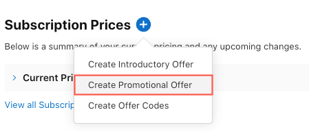

Provide an **Offer Reference Name** (which is just for your reference and not seen by the user) for the promotion, along with a unique **Promotional Offer Identifier** for the offer:

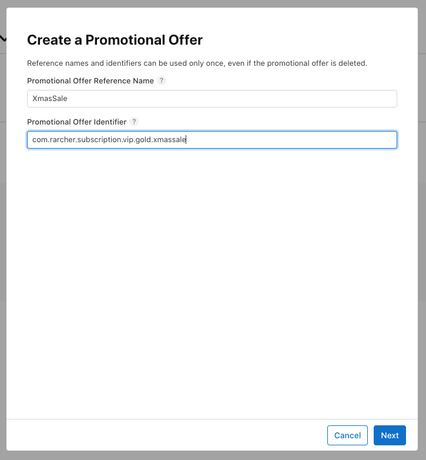

Next, choose the pricing model (pay-as-you-go, up-front, or free) and the price. Notice that you'll see at the bottom of the window how the user will pay during the promotion:

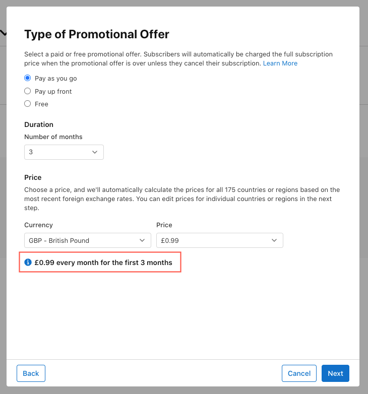

App Store Connect will now calculate prices for all the different regions, which you can override if you wish:

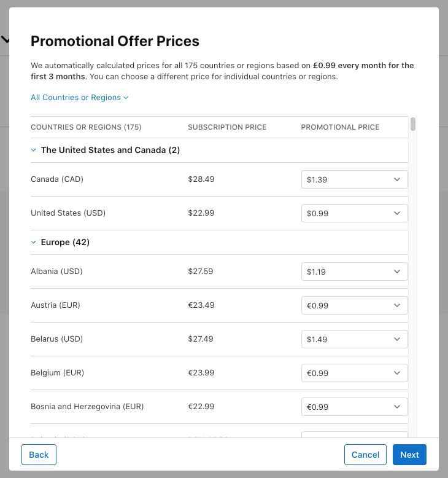

Confirm the prices:


### Subscription Offer Keys
Your promotional offer has been created. However, you'll see a warning that you need to create a **subscription key** for signing offers:

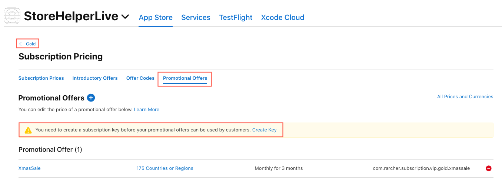

Every request to purchase a subscription using a promotional offer must be **digitally signed**. 
Click **Create Key** to jump to **Users and Access > Keys**, then click **Generate In-App Purchase Key**:


Create a reference name for the key and click **Generate**:


The key is generated. You should now download and save the key. Note that you will not be able to download the again, so make sure to store it safely:


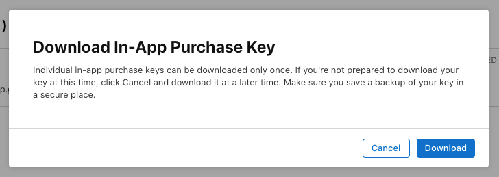

This key should be used the **production** and the **sandbox** test environment.
Note that you can ask Xcode to create a test key for the StoreKit Testing environment. 
With your `Products.storekit` file open, select **Editor > Subscription Offers Key**:

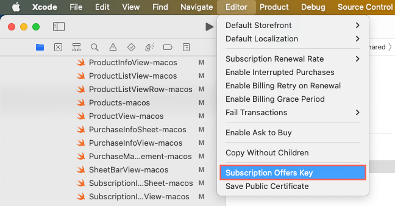


Creating an **Introductory Offer** is a very similar process, which we won't bother to describe in detail here.


> Note that although you can create an introductory offer for each subscription product in App Store Connect, each user is only eligible to redeem **one** introductory offer per subscription group. 
> See [Set up an introductory offer](https://help.apple.com/app-store-connect/#/deve1d49254f) for details.

## Defining offers in the StoreKit Testing environment
Promotional and Introductory Offers can also be setup in Xcode for the StoreKit Testing environment by opening the `Products.storekit` file:


## How StoreHelper displays Standard, Promotional or Introductory Offer Prices
By default, `StoreHelper` automatically does all the work required to determine which price and renewal period to display for each subscription product. It also makes a handy `struct` available (`PrePurchaseSubscriptionInfo`) which contains information related to subscription pricing and promotional and introductory offers. In addition, `SubscriptionHelper` provides a number of methods that are helpful if you wish to create a custom UI solution, including `hasLowerValueCurrentSubscription(than:)`, `isLapsedSubscriber(to:)` and `allSubscriptionTransactions()`.

Referring to the image below, `PriceView` is responsible for displaying prices (e.g. "$1.99"), and in the case of standard subscriptions prices and renewal periods (e.g. "$2.99 / month"). Promotional and introductory offers are displayed in form "3 months at a promotional price of $2.99":


Looking in further detail, when `PriceView` appears it decides if the product it's being asked to display a price for is a subscription. If it is, it calls `StoreHelper.isSubscribed(productId:)` to see if the user is already subscribed. If they're not subscribed, it calls `PriceViewModel.getPrePurchaseSubscriptionInfo(productId:)` to construct a `PrePurchaseSubscriptionInfo` object containing detailed information about the subscription, including price and renewal period, plus any eligible promotional or introductory offers that have been defined:

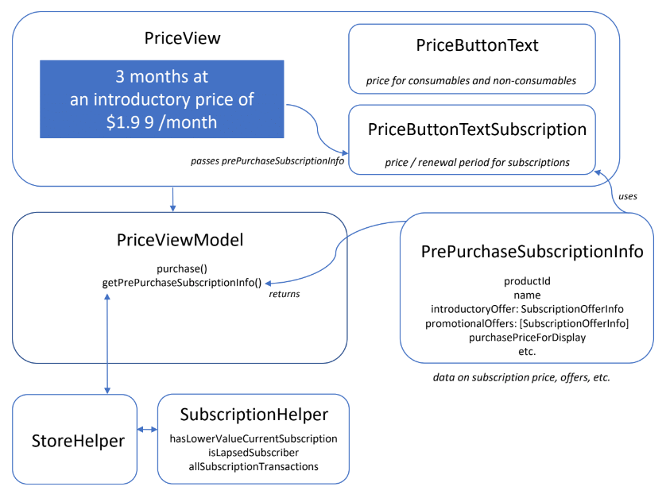

The following rules (in order of precedence) determine which price or offers are displayed by `PriceView`:

- A **promotional offer** (and there can be more than one) will be displayed if the user is:
    - a current subscriber to a *lower-value* subscription in the subscription group, **or**
    - a lapsed subscriber to this subscription

- A **introductory offer** will be displayed if the user is:
    - not a current subscriber to this subscription, **and**
    - not a lapsed subscriber to this or any other subscription in the subscription group

- If none of the above rules apply, the **standard price** and renewal period are displayed 

## Supporting In-App Offer Code Redemption 
You may create **Offer Codes** for subscriptions in App Store Connect and in Xcode for the StoreKit Testing environment. Offer codes are alpha numeric codes that can be distributed to selected users offering free or discounted products. Codes can be redeemed by users through the App Store via the *Redeem Gift Card or Code* page, in-app through the use of the `presentCodeRedemptionSheet()` method, or by the creation of special one-time code redemption URLs.

To create offer codes in App Store Connect, navigate to the in-app purchase product for which you want to create offer codes, click the **Subscription Prices +** button and select **Create Offer Codes**:

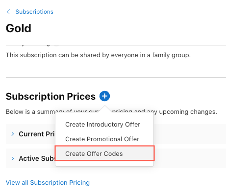

Give the offer a reference name and select eligibility:


Select the countries and regions where the offer will be available:

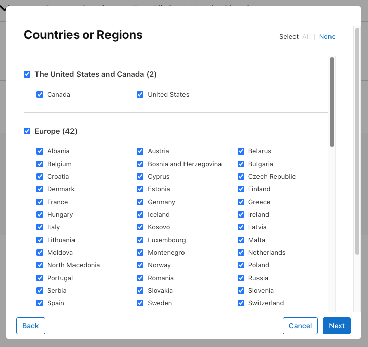

Then setup the type of offer you want to provide:

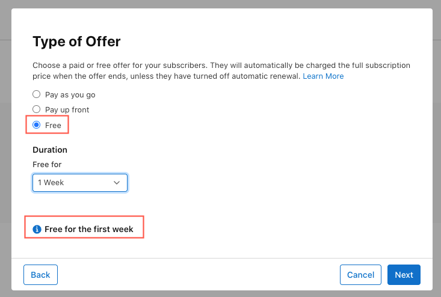

Confirm the pricing:

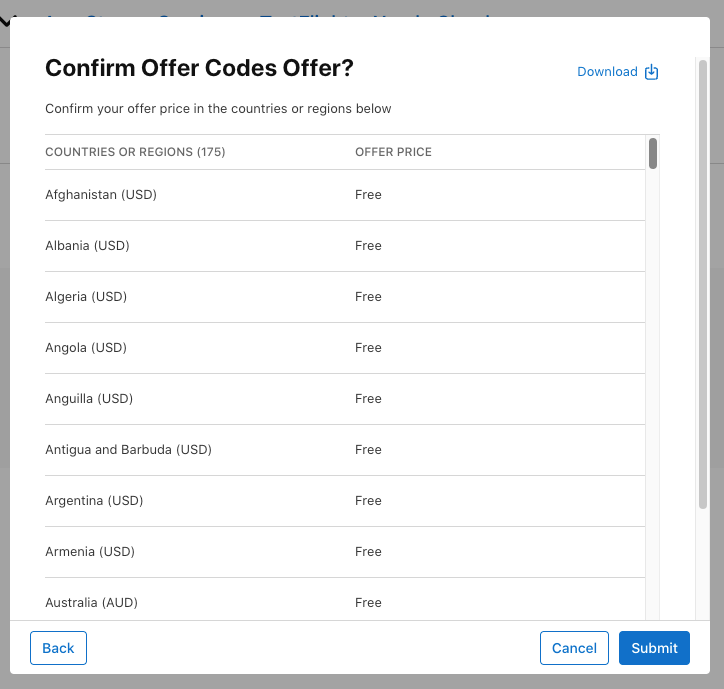

You offer codes are now available for use:

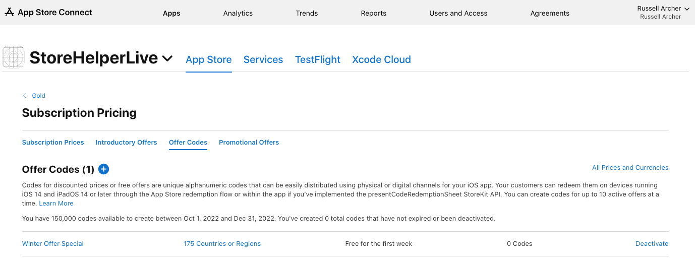

To create codes for use in the StoreKit Testing environment, open the `Products.storekit` file, select your subscription product and define your offer:

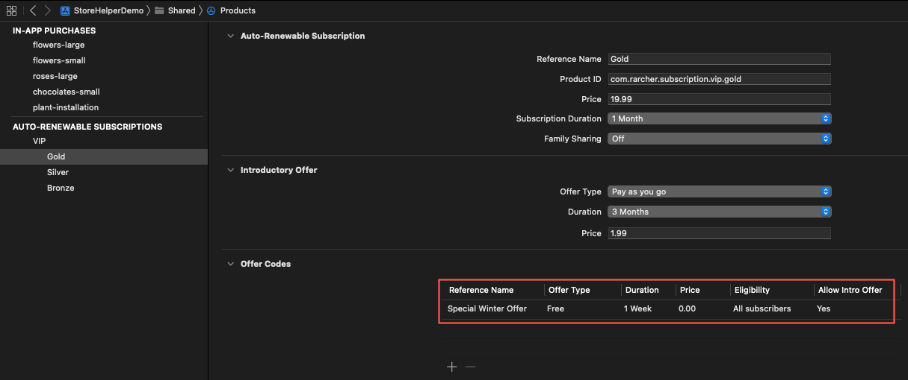

If you are building for **iOS 16 or macOS 13** or higher, `StoreHelper` now provides an in-app sheet that enables the user to redeem promotional codes. A button for the user to redeem codes is displayed at the bottom of the product listing:

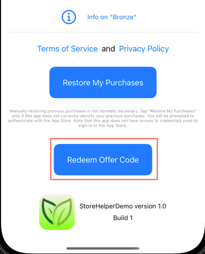

`RedeemOfferCodeView` view handles the display of the sheet using `.offerCodeRedemption(isPresented:)`:

```swift
import SwiftUI
import StoreKit

public struct RedeemOfferCodeView: View {
    @EnvironmentObject var storeHelper: StoreHelper
    @Binding var showRedeemOfferCodeButton: Bool
    @Binding var showRedeemOfferCodeError: Bool
    
    public init(showRedeemOfferCodeButton: Binding<Bool>, showRedeemOfferCodeError: Binding<Bool>) {
        self._showRedeemOfferCodeButton = showRedeemOfferCodeButton
        self._showRedeemOfferCodeError = showRedeemOfferCodeError
    }
    public var body: some View {
        if #available(iOS 16.0, *) {
            if let redeemOfferCodeButtonText = Configuration.redeemOfferCodeButtonText.value(storeHelper: storeHelper) {
                Button(action: {
                    showRedeemOfferCodeButton = true
                }) { BodyFont(scaleFactor: storeHelper.fontScaleFactor) { Text(redeemOfferCodeButtonText)}.padding()}
                    .buttonStyle(.borderedProminent).padding()
                    .offerCodeRedemption(isPresented: $showRedeemOfferCodeButton) { result in
                        switch result {
                            case .failure(_): showRedeemOfferCodeError = true
                            case .success(): break
                        }
                    }
            }
        } else {
            EmptyView()
        }
    }
}
```

When the user taps of the redeem offer code button the following sheet is presented:

![[StoreHelper Demo 137.png]]

The user can select the offer ("Special Winter Offer") and then tap **Redeem Code**:

![[StoreHelper Demo 138.png]]

Notice how the offer code gives the user a 1 week free trial, then the 3-month introductory offer, followed by the standard monthly subscription price.

![[StoreHelper Demo 139.png]]

# Managing Subscriptions
If you want to see ALL your Apple subscriptions you can navigate to **Settings > AppleID > Subscriptions**. From here you can view, upgrade, downgrade, or cancel subscriptions.


You can also manage subscriptions from your Mac using the **App Store** app. See https://support.apple.com/en-us/HT202039 for more details. 

However, the problem with this approach is that many users don't think to look in **Settings** to cancel a subscription. It seems that a commonly held belief is that if you simply delete an app from your phone this will automatically cancel any associated subscriptions.

What's required is some way of managing subscriptions from *within* the app.

`StoreHelper` provides a **Manage Subscriptions** button at the bottom of the **Subscription Information** sheet:


With iOS 15 we can now display a sheet to allow to the user to manage a subscription using the `.manageSubscriptionsSheet(isPresented:)` view modifier (this view modifier is not available for macOS or tvOS):

```swift
struct SubscriptionInfoSheet: View {
    @State private var showManageSubscriptionsSheet = false
    
    var body: some View {
        VStack {
            
			:
			:
                    
			Button(action: {
				withAnimation { showManageSubscriptionsSheet.toggle()}
			}) { Label("Manage Subscriptions", systemImage: "creditcard.circle")}.buttonStyle(.borderedProminent)}
        }
        #if os(iOS)
        .manageSubscriptionsSheet(isPresented: $showManageSubscriptionsSheet)
        #endif
    }
}
```

Apple's documentation says it doesn't (yet) work with StoreKit testing in Xcode, and that you have to test subscription management in the sandbox environment. However, using Xcode 13.2 and iOS15.2 it **does** *seem* to work in the simulator.

Tapping **Manage Subscription** displays the following sheet:


If you tap **Cancel Subscription**, `StoreKit2` and `StoreHelper` correctly see that the subscription has been cancelled:


# Refunds
Another issue that has been a source of annoyance for many years is the ability to issue users with a refund. The only resources available for developers are App Store support, via a [support article](https://support.apple.com/en-us/HT204084), or Apple's [dedicated refund website](https://reportaproblem.apple.com/?s=6).

In iOS15 (but not macOS or tvOS) we now have the ability to display a refund request sheet from within our apps. The refund sheet shows the user’s transaction details, along with a list of "why I want a refund" codes for the customer to choose from. 

> Note that developers don't have the ability to ***grant*** the user a refund, but simply the means to *initiate* the refund request process with Apple on the user's behalf.

The `PurchaseInfoSheet` displays a **Request Refund** button at the bottom of the sheet:


Tapping **Request Refund** shows:


The following shows how to display the refund request sheet:

```swift
struct Products: View {
    @State private var showRefundSheet = false
    
    @ViewBuilder var body: some View {
        VStack { ... }
        #if os(iOS)
        .refundRequestSheet(for: refundRequestTransactionId, isPresented: $showRefundSheet) { refundRequestStatus in
            switch(refundRequestStatus) {
                case .failure(_): refundAlertText = "Refund request submission failed"
                case .success(_): refundAlertText = "Refund request submitted successfully"
            }
        }
        #endif
    }
}
```

Apple normally responds to the user within 48 hours of a refund request.

More details are available in the WWDC21 video [Support customers and handle refunds](https://developer.apple.com/videos/play/wwdc2021/10175/#:~:text=We%20are%20now%20introducing%20a,notification%20from%20the%20App%20Store).

# Direct purchases of App Store Promotions
Apple allows you to promote in-app purchases for sale directly on the App Store. This allows users to purchase your products from the App Store itself, rather than from within your app. 

The requirement for supporting this feature is that your app must include a class that implements `SKPaymentTransactionObserver`, and the `paymentQueue(_:updatedTransactions:)`
and `paymentQueue(_:shouldAddStorePayment:for:)` delegate methods. If you don't include these requirements then you'll get an error when you attempt to submit the app to the App Store and you have existing IAP promotions.

However, `StoreKit2` doesn't include any of these: they're old-style `StoreKit1` things! I bet this will catch out a lot of people (me included)!

`StoreHelper` has a solution to this potentially messy situation. It includes a class that handles all the requirements and tells the `StoreKit2`-based code when a direct App Store purchase is made:

```swift
import StoreKit

/// Support for StoreKit1. Tells the observer that a user initiated an in-app purchase direct from the App Store,
/// rather than via the app itself. StoreKit2 does not (yet) provide support for this feature so we need to use
/// StoreKit1. This is a requirement in order to promote in-app purchases on the App Store. If your app doesn't
/// have a class that implements `SKPaymentTransactionObserver` and the `paymentQueue(_:updatedTransactions:)`
/// and `paymentQueue(_:shouldAddStorePayment:for:)` delegate methods then you'll get an error when you submit
/// the app to the App Store and you have IAP promotions.
///
/// Note that any IAPs made from **inside** the app are processed by StoreKit2 and do not involve this helper class.
public class AppStoreHelper: NSObject, SKPaymentTransactionObserver {

    private weak var storeHelper: StoreHelper?
    
    public convenience init(storeHelper: StoreHelper) {
        self.init()
        self.storeHelper = storeHelper
    }
    
    public override init() {
        super.init()
        
        // Add ourselves as an observer of the StoreKit payments queue. This allows us to receive
        // notifications for when payments are successful, fail, are restored, etc.
        SKPaymentQueue.default().add(self)
    }
    
    /// Delegate method for the StoreKit1 payment queue. Note that because our main StoreKit processing is done
    /// via StoreKit2 in StoreHelper, all we have to do here is signal to StoreKit1 to finish purchased, restored
    /// or failed transactions. StoreKit1 purchases are immediately available to StoreKit2 (and vice versa), so
    /// any purchase will be picked up by StoreHelper as required.
    /// - Parameters:
    ///   - queue: StoreKit1 payment queue
    ///   - transactions: Collection of updated transactions (e.g. `purchased`)
    public func paymentQueue(_ queue: SKPaymentQueue, updatedTransactions transactions: [SKPaymentTransaction]) {
        for transaction in transactions {
            switch (transaction.transactionState) {
                case .purchased:
                    SKPaymentQueue.default().finishTransaction(transaction)
                    Task.init { await storeHelper?.productPurchased(transaction.payment.productIdentifier) }  // Tell StoreKit2-based StoreHelper about purchase
                case .restored: fallthrough
                case .failed: SKPaymentQueue.default().finishTransaction(transaction)
                default: break
            }
        }
    }
    
    /// Lets us know a user initiated an in-app purchase direct from the App Store, rather than via the app itself.
    /// This method is required if you have IAP promotions.
    public func paymentQueue(_ queue: SKPaymentQueue, shouldAddStorePayment payment: SKPayment, for product: SKProduct) -> Bool {
        // Return true to continue the transaction. If this IAP has been previously purchased it'll be picked up
        // by StoreKit1 and re-purchase prevented
        return true
    }
}
```
