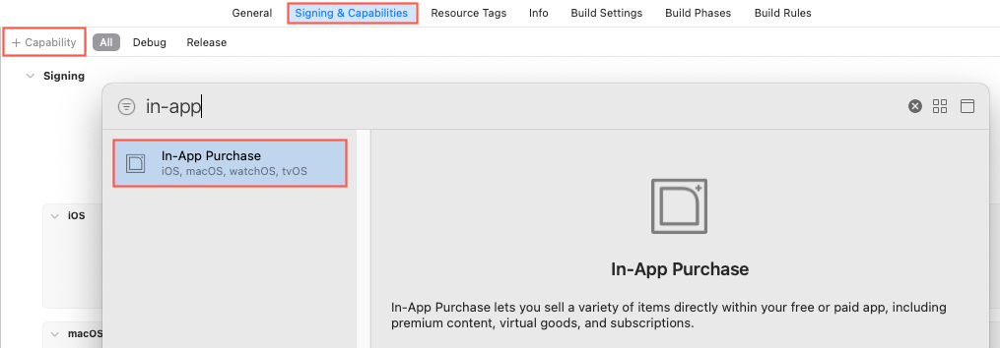
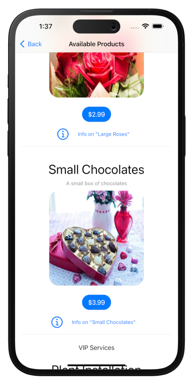

# StoreHelper Quick Start

# Description


- See [StoreHelper](https://github.com/russell-archer/StoreHelper) for an overview of the `StoreHelper` package
- See [StoreHelper Guide](https://github.com/russell-archer/StoreHelper/blob/main/Documentation/guide.md) for in-depth discussion and tutorial on using `StoreHelper`, `StoreKit2` with **Xcode 14**, **iOS 16** and **macOS 13**
- See [StoreHelperDemo](https://github.com/russell-archer/StoreHelperDemo) for an example SwiftUI project using StoreHelper with **Xcode 14** and **iOS 16**

# Contents

- [Description](#Description)
- [Contents](#Contents)
- [Quick Start](#Quick-Start)
	- [Use StoreHelper to support in-app purchases](#Use-StoreHelper-to-support-in-app-purchases)
	- [What you'll need](#What-you'll-need)
	- [Steps](#Steps)
		- [Getting the StoreHelper Package](#Getting-the-StoreHelper-Package)
		- [Create the App struct](#Create-the-App-struct)
		- [Create MainView](#Create-MainView)
		- [Create ProductView](#Create-ProductView)
		- [Modify ContentView](#Modify-ContentView)
		- [Create the ProductInfo View](#Create-the-ProductInfo-View)
		- [Create SimplePurchaseView](#Create-SimplePurchaseView)
		- [Add Product Images](#Add-Product-Images)
		- [Add Product Configuration Files](#Add-Product-Configuration-Files)
		- [Run the App](#Run-the-App)

---

# Quick Start
The following steps show to use `StoreHelper` to create a bare-bones SwiftUI demo app that supports in-app purchases on **iOS 16** and **macOS 13**.

See [StoreHelperDemo](https://github.com/russell-archer/StoreHelperDemo) for an example SwiftUI project using `StoreHelper` with Xcode 14.

## What you'll need
- **Xcode 14** installed on your Mac
- Basic familiarity with **Xcode**, **Swift** and **SwiftUI**
- About 15-minutes!

# Steps
## Getting the StoreHelper Package
- Open Xcode and create a new project. Use either the **iOS app**, **macOS app** or **multi-platform app** template. These steps use the multi-platform template to create an app named **"StoreHelperDemo"**
- Select **File > Add Packages...**
- Paste the URL of the `StoreHelper` package into the search box: 

    - https://github.com/russell-archer/StoreHelper

- Click **Add Package**:


- Xcode will fetch the package from GitHub and then display a confirmation. Click **Add Package**:


- The project should now look like this:


- Notice that the `StoreHelper` and `swift-collections` packages have been added to the project. `swift-collections` is a package dependency for `StoreHelper`
- If you expand the `StoreHelper` package you'll be able to see the source:


- Select the project's **target**. Notice that `StoreHelper` has been added as a library for the **iOS**, iPad **and** **macOS** targets:


- With the project's target selected, add the **In-App Purchase** capability:



- Adding the in-app purchase capability will automatically add the `StoreKit` framework to your project:


## Create the App struct
- Open `StoreHelperExampleApp.swift` and replace the existing code with the following:

> Alternatively, you can copy everything required for the **StoreHelperDemo** app from the **StoreHelper > Samples** folder:
> - Delete **ContentView.swift** and **Your-Project-NameApp.swift** from your project and move them to the trash
> - Select any file in the **StoreHelper > Samples > Code** folder in Xcode, right-click it and select **Show in Finder**
> - In Finder, select all the files in the **Code** directory and drag them into into your project's main folder in Xcode. Select **Copy items if needed** when prompted
> - Rename **StoreHelperDemoApp.swift** to **Your-Project-NameApp.swift**, also rename the struct from `StoreHelperDemoApp` to `Your-Project-NameApp`
> - In Finder, select all files (except the readme.md) in the **Configuration** directory and drag them into your project's main folder in Xcode. Select **Copy items if needed** when prompted
> - Rename **SampleProducts.plist** to **Products.plist** and **SampleProducts.storekit** to **Products.storekit**
> - In Finder, select all images in the **Images** directory and drag them into your project's **Asset Catalog** in Xcode

```swift
import SwiftUI
import StoreHelper

@available(iOS 15.0, macOS 12.0, *)
@main
struct StoreHelperDemoApp: App {
    @StateObject var storeHelper = StoreHelper()
    
    var body: some Scene {
        WindowGroup {
            MainView()
                .environmentObject(storeHelper)
                .task { storeHelper.start() }  // Start listening for transactions
                #if os(macOS)
                .frame(minWidth: 700, idealWidth: 700, minHeight: 700, idealHeight: 700)
                .font(.title2)
                #endif
        }
    }
}
```

- Notice how we `import StoreHelper`, create an instance of the `StoreHelper` class and add it to the SwiftUI view hierarchy using the `.environment()` modifier 
- We also call `storeHelper.start()` to begin listening for App Store transactions. This should be done as soon as possible during app start-up

## Create MainView
- Create a new SwiftUI `View` in the **Shared** folder named `MainView` and replace the existing code with the following:

```swift
import SwiftUI

@available(iOS 15.0, macOS 12.0, *)
struct MainView: View {
    let largeFlowersId = "com.rarcher.nonconsumable.flowers.large"
    let smallFlowersId = "com.rarcher.nonconsumable.flowers.small"
    
    var body: some View {
        NavigationView {
            List {
                NavigationLink(destination: ContentView()) { Text("Product List").font(.largeTitle).padding()}
                NavigationLink(destination: ProductView(productId: largeFlowersId)) { Text("Large Flowers").font(.largeTitle).padding()}
                NavigationLink(destination: ProductView(productId: smallFlowersId)) { Text("Small Flowers").font(.largeTitle).padding()}
                NavigationLink(destination: SubscriptionView()) { Text("Subscriptions").font(.largeTitle).padding()}
                NavigationLink(destination: SimplePurchaseView()) { Text("Simple Purchase").font(.largeTitle).padding()}
            }
        }
        #if os(iOS)
        .navigationViewStyle(.stack)
        .navigationBarTitle(Text("StoreHelperDemo"), displayMode: .large)
        #endif
    }
}
```

- `MainView` provides simple navigation to `ContentView`, which shows a list of available products, and `ProductView` which gives the user access to a particular product if they've purchased it
- Notice how we pass the `ProductId` for either the "Large Flowers" or "Small Flowers" product to `ProductView`

## Create ProductView
- Create a new SwiftUI `View` named `ProductView` and save it to the **Shared** folder. Replace the existing code with the following:

```swift
import SwiftUI
import StoreHelper

@available(iOS 15.0, macOS 12.0, *)
struct ProductView: View {
    @EnvironmentObject var storeHelper: StoreHelper
    @State private var isPurchased = false
    var productId: ProductId
    
    var body: some View {
        VStack {
            if isPurchased {
                Image(productId).bodyImage()
                Text("You have purchased this product and have full access 😀").font(.title).foregroundColor(.green)
            } else {
                Text("Sorry, you have not purchased this product and do not have access 😢").font(.title).foregroundColor(.red)
            }
        }
        .padding()
        .task {
            if let purchased = try? await storeHelper.isPurchased(productId: productId) {
                isPurchased = purchased
            }
        }
    }
}
```

- Notice that when the `VStack` appears we asynchronously call `StoreHelper.isPurchased(productId:)` to see if the user has purchased the product 

## Modify ContentView
- Open `ContentView.swift` and replace the existing code with the following:

```swift
import SwiftUI
import StoreHelper

@available(iOS 15.0, macOS 12.0, *)
struct ContentView: View {
    @State private var showProductInfoSheet = false
    @State private var productId: ProductId = ""
    
    var body: some View {
        ScrollView {
            Products() { id in
                productId = id
                showProductInfoSheet = true
            }
            .sheet(isPresented: $showProductInfoSheet) {
                VStack {
                    // Pull in text and images that explain the particular product identified by `productId`
                    ProductInfo(productInfoProductId: $productId, showProductInfoSheet: $showProductInfoSheet)
                }
                #if os(macOS)
                .frame(minWidth: 500, idealWidth: 500, maxWidth: 500, minHeight: 500, idealHeight: 500, maxHeight: 500)
                #endif
            }
        }
    }
}
```

- The above creates the `StoreHelper Products` view. This view displays a list of your configured products (we haven't configured them yet), allow the user to purchase products and see detailed information about purchases
- If the user taps on a product's **More Info** button, the `Products` view provides the unique `ProductId` of that product to our app via a closure. We can then display a view or (as in this example) sheet showing details of the product, and why the user might want to purchase it
- We hand-off the presentation of our product information details to the (as yet undefined) `ProductInfo` view

## Create the ProductInfo View
- Create a new SwiftUI view in the **Shared** folder named `ProductInfo.swift`. Replace the existing code with the following:

```swift
import SwiftUI
import StoreHelper
import StoreKit

@available(iOS 15.0, macOS 12.0, *)
struct ProductInfo: View {
    @EnvironmentObject var storeHelper: StoreHelper
    @State private var product: Product?
    @Binding var productInfoProductId: ProductId
    @Binding var showProductInfoSheet: Bool
    
    var body: some View {
        VStack {
            SheetBarView(showSheet: $showProductInfoSheet, title: product?.displayName ?? "Product Info")
            ScrollView {
                VStack {
                    if let p = product {
                        Image(p.id)
                            .resizable()
                            .frame(maxWidth: 200, maxHeight: 200)
                            .aspectRatio(contentMode: .fit)
                            .cornerRadius(25)
                    }
                    
                    // Pull in the text appropriate for the product
                    switch productInfoProductId {
                        case "com.rarcher.nonconsumable.flowers.large": ProductInfoFlowersLarge()
                        case "com.rarcher.nonconsumable.flowers.small": ProductInfoFlowersSmall()
                        default: ProductInfoDefault()
                    }
                }
                .padding(.bottom)
            }
        }
        .onAppear {
            product = storeHelper.product(from: productInfoProductId)
        }
    }
}

@available(iOS 15.0, macOS 12.0, *)
struct ProductInfoFlowersLarge: View {
    @ViewBuilder var body: some View {
        Text("This is a information about the **Large Flowers** product.").font(.title2).padding().multilineTextAlignment(.center)
        Text("Add text and images explaining this product here.").font(.title3).padding().multilineTextAlignment(.center)
    }
}

@available(iOS 15.0, macOS 12.0, *)
struct ProductInfoFlowersSmall: View {
    @ViewBuilder var body: some View {
        Text("This is a information about the **Small Flowers** product.").font(.title2).padding().multilineTextAlignment(.center)
        Text("Add text and images explaining this product here.").font(.title3).padding().multilineTextAlignment(.center)
    }
}

@available(iOS 15.0, macOS 12.0, *)
struct ProductInfoDefault: View {
    @ViewBuilder var body: some View {
        Text("This is generic information about a product.").font(.title2).padding().multilineTextAlignment(.center)
        Text("Add text and images explaining your product here.").font(.title3).padding().multilineTextAlignment(.center)
    }
}
```

- `ProductInfo` uses `StoreHelper.product(from:)` to retrieve a `StoreKit2 Product` struct, which gives localized information about the product

## Create SimplePurchaseView
- Create a new SwiftUI view in the **Shared** folder named `SimplePurchaseView.swift`. Replace the existing code with the following:

```swift
import SwiftUI
import StoreKit
import StoreHelper

struct SimplePurchaseView: View {
    @EnvironmentObject var storeHelper: StoreHelper
    @State var purchaseState: PurchaseState = .unknown
    var price = "1.99"
    let productId = "com.rarcher.nonconsumable.flowers.large"
    
    var body: some View {
        VStack {
            Text("This view shows how to create a minimal purchase page for a product. The product shown is **Large Flowers**").multilineTextAlignment(.center)
            Image(productId)
                .resizable()
                .frame(maxWidth: 250, maxHeight: 250)
                .aspectRatio(contentMode: .fit)
                .cornerRadius(25)
            
            PurchaseButton(purchaseState: $purchaseState, productId: productId, price: price).padding()
            
            if purchaseState == .purchased {
                Text("This product has already been purchased").multilineTextAlignment(.center)
            } else {
                Text("This product is available for purchase").multilineTextAlignment(.center)
            }
            
            Spacer()
        }
        .padding()
        .task {
            let purchased = (try? await storeHelper.isPurchased(productId: productId)) ?? false
            purchaseState = purchased ? .purchased : .unknown
        }
    }
}
```

## Add Product Images
- Select any file in the **StoreHelper > Samples > Images** folder in Xcode, right-click it and select **Show in Finder**
- In Finder, select all images in the **Images** directory and drag them into your project's **Asset Catalog** in Xcode
- These images have filenames that are the same as the product ids for the products which they represent

## Add Product Configuration Files
- Select any file in the **StoreHelper > Samples > Configuration** folder in Xcode, right-click it and select **Show in Finder**
- In Finder, select all files (except readme.md) in the **Configuration** directory and drag them into your project's main folder in Xcode. Select **Copy items if needed** when prompted
- Rename **SampleProducts.plist** to **Products.plist** and **SampleProducts.storekit** to **Products.storekit**
- Select your project's **target** and then select **Product > Scheme> Edit Scheme**
- Select the `Products.storekit` file in the **StoreKit Configuration** field:


## Run the App
- Select the **iOS target** and run it in the simulator:
    - The MainView provides navigation to the **Products List** and product access views
    - The **Products List** view displays a list of products, along with images and descriptions
    - Try purchasing the **Large Flowers** product
    - Your demo app supports a complete range of in-app purchase-related features. See the documentation for `StoreHelper` for a full list of features
    - Try selecting "Large Flowers" from the main view. If you've purchased it you should see that you have access, otherwise you'll see a "no access" error 



